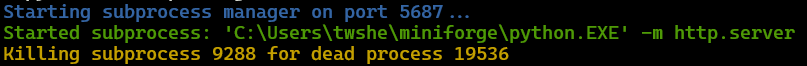

# subproc_mgr

## Motivation

Applications that spawn long-running subprocesses need to be able to manage the lifetime of those subprocesses, which is so-far not a truth as the application can exit unexpectedly (e.g., runtime, or buggy high-level software).

This is a simple service that can be deployed globally that proxies subprocess spawning and manages the lifetime. The service will periodically check the lifetime of the subprocesses and kill them if they have exceeded the expected lifetime.

P.S: This approach could be better (easier and cheaper) than a watchdog if you have a consensus conventions on how to spawn subprocesses.

## Usage

1. The service should be started:

    ```shell
    usage: subproc_mgr [-h] [--port PORT] [--period PERIOD] [port] [period]


        port: port that the service is deployed on
        period: how often the service checks the lifetime of subprocesses


    positional arguments:
        port             <class 'int'>
        period           <class 'float'>

    options:
        -h, --help       show this help message and exit
        --port PORT      <class 'int'>
        --period PERIOD  <class 'float'>
    ```

2. We send requests (e.g., HTTP requests) to use the service:

    ```shell
    shell> cat usage_example.py
    shell> python usage_example.py
    ```

    ```python

    from typing import TypedDict
    import requests, os, shutil

    PORT = 5687

    class StartProcessRequest(TypedDict):
        command: str
        args: list[str]
        env: dict[str, str]
        pid: int

    # start python -m http.server
    resp = requests.post(
        f"http://localhost:{PORT}/spawn",
        json=StartProcessRequest(
            command=shutil.which("python") or "python",
            args=['-m', 'http.server'],
            env=dict(os.environ),
            pid=os.getpid()
        )
    )

    assert resp.json().get("code") == "success"

    # press Ctrl+D, the subprocess exits very sooner
    while True:
        import time
        time.sleep(0.5)
    ```

3. Press ctrl+D for the terminal that executes `python usage_example.py`. You'll see the following logs from the service.

    

## Motivation (for the author)

1. Extending VSCode with dynamically added commands/key bindings.
2. Starting a language runtime and managing the lifetime of its parser server.
